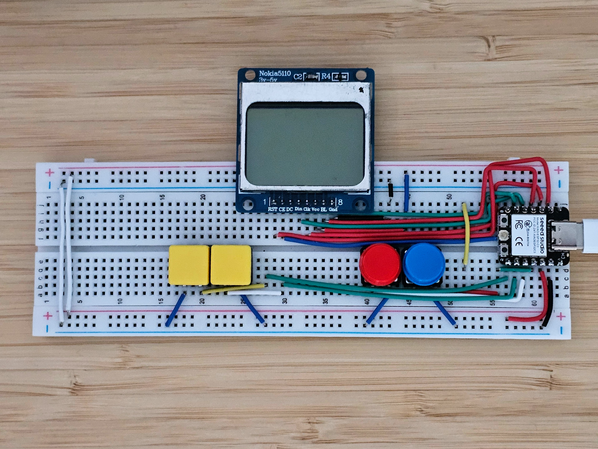

# Micro Console

Tiny ESP32 powered handheld console using PlatformIO, a Nokia 5110 / PCD8544 LCD, and four tactile buttons.



## Bundled Games

- Snake
- Pong
- Breakout
- Flappy bird
- Space Invaders
- Asteroids
- Button test

## Controls

In the **Console Shell**:

- `LEFT` / `RIGHT`: choose a game.
- `A`: launch the selected game.

In game:

- Hold `B` for about 1 second to return to the **Console Shell**.
- The controls vary by game.

## Hardware

The console is based on SeedStudio ESP32-C3 microcontroller.

Target board: `esp32-c3-devkitm-1`

Display: Nokia 5110 / PCD8544, 84x48 monochrome LCD.

Buttons: four tactile switches wired between GPIO and GND. Firmware enables ESP32 internal pullups, so no external pullup resistors are required.

## Wiring

| Nokia 5110 pin  | ESP32-C3 pin | Firmware name       |
| --------------- | ------------ | ------------------- |
| VCC             | 3V3          | -                   |
| GND             | GND          | -                   |
| CLK / SCLK      | GPIO4        | `LCD_CLK_PIN`       |
| DIN / DN / MOSI | GPIO6        | `LCD_DIN_PIN`       |
| DC / D-C        | GPIO7        | `LCD_DC_PIN`        |
| CE / CS / SCE   | GPIO21       | `LCD_CS_PIN`        |
| RST             | GPIO3        | `LCD_RESET_PIN`     |
| LIGHT / BL      | GPIO5        | `LCD_BACKLIGHT_PIN` |

| Button | ESP32-C3 pin | Wiring                        |
| ------ | ------------ | ----------------------------- |
| LEFT   | GPIO20       | Button between GPIO20 and GND |
| RIGHT  | GPIO8        | Button between GPIO8 and GND  |
| A      | GPIO9        | Button between GPIO9 and GND  |
| B      | GPIO10       | Button between GPIO10 and GND |

## Build And Upload

This project uses `mise` for tool management.
Install the mise-managed tools and Python package dependencies once:

```sh
mise install
mise run install
```

Compile the firmware:

```sh
mise run build
```

Upload the firmware to the connected ESP32 board:

```sh
mise run upload
```

Open the serial monitor:

```sh
mise run monitor
```

Clean build output:

```sh
mise run clean
```
